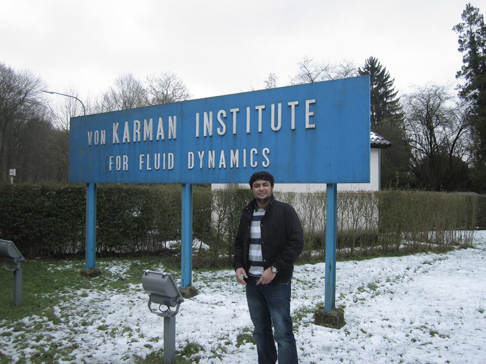

# Welcome!

    

    
Thank you for visiting my personal technology blog

    
I am Dinesh Chandrasekaran, ASQ-CSSBB, PMP, PMI-ACP, SAFe® 4 Agilist (SA), SAFe® 4 Practitioner (SP). I have completed Master Sciences ET Technologies offered jointly by Ecole Centrale de Lille, Ecole Nationale Supérieure de Mécanique et d’Aérotechnique de Poitiers and Ecole Nationale Supérieure d’Ingénieurs de Poitiers, France. The Master Program majorly focussed on Turbulence, Mathematical Modeling, Analytical and Computational Techniques.

    
I have around twelve years of industry and research experience in Big Data, Data Science and Project Management. Experience in building real time data pipelines, managing Big Data Platform, and coaching teams to adopt Six Sigma and Agile Methodology including Scrum and Kanban. Experience in developing Machine Learning algorithms and applying Statistical Techniques to improve the process and product performance.

    
My favorite things in life includes South Indian food cuisine, exploring Chennai city and supporting Chennai Super Kings cricket team.

    
On a personal note, I am constantly trying to learn how to be better at things that really matters, like living for a purpose, appreciating people, and adapting to the changes.

    
I have been learning and practicing data science for past few years and thought I would share my experiences along the way as I recap what I have learnt till date. This blog will keep my learning structured and help me keep focused. Hopefully by sharing useful resources would help someone new to data science.

    <!-- 
For further details and contents, please visit the repository on <a href="https://github.com/dchandra1985/Data_Science">Github</a>
 -->

    
Contact me @ <a href="https://www.linkedin.com/in/dinesh-chandrasekaran-49731b15/">linkedin</a>,<a href="mailto:chandrasekarandinesh1985@gmail.com">email</a>

    

