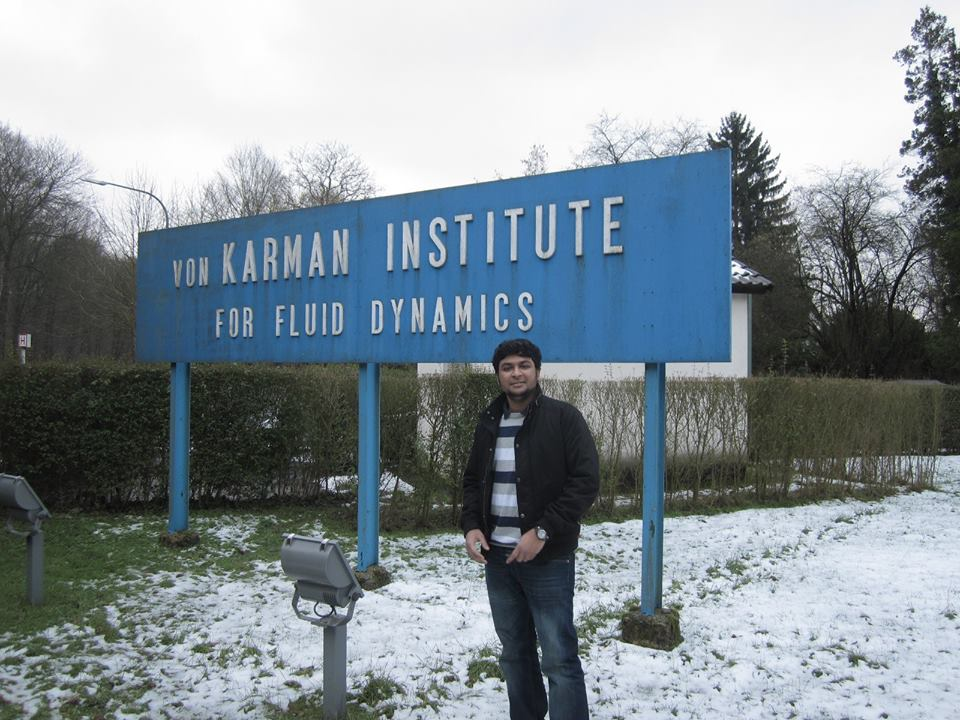

# Welcome!

    

    
Thank you for visiting my personal technology blog

    
I am Dinesh Chandrasekaran, ASQ-CSSBB, PMP, PMI-ACP, Azure Data Scientist. I have completed Master Sciences ET Technologies offered jointly by Ecole Centrale de Lille, Ecole Nationale Supérieure de Mécanique et d’Aérotechnique de Poitiers and Ecole Nationale Supérieure d’Ingénieurs de Poitiers, France. The Master Program majorly focussed on Turbulence, Mathematical Modeling, Analytical and Computational Techniques. Recently completed PG Level advanced certification programme on Machine Learning and AI for autonomous systems at Indian Institute of Science (IISc, Bangalore) 

    
I have a total of 15 years of industry experience, including approximately 6 years specializing in Big Data, Data Engineering, and Artificial Intelligence . Experienced in setting up enterprise‑scale data lakes, designing robust data models, and preparing high‑quality data pipelines to support Artificial Intelligence initiatives. Experienced in designing and implementing multi‑agent AI systems for real‑time data platforms, enabling autonomous data processing, monitoring, and decision‑making.

    
My favorite things in life includes South Indian food cuisine, exploring Chennai city and supporting Chennai Super Kings cricket team.

    
On a personal note, I am constantly trying to learn how to be better at things that really matters, like living for a purpose, appreciating people, and adapting to the changes.

    
I have been learning and practicing data science for past few years and thought I would share my experiences along the way as I recap what I have learnt till date. This blog will keep my learning structured and help me keep focused. Hopefully by sharing useful resources would help someone new to data science.

    <!-- 
For further details and contents, please visit the repository on <a href="https://github.com/dchandra1985/Data_Science">Github</a>
 -->

    
Contact me @ <a href="https://www.linkedin.com/in/dinesh-chandrasekaran-49731b15/">linkedin</a>,<a href="mailto:chandrasekarandinesh1985@gmail.com">email</a>

    

